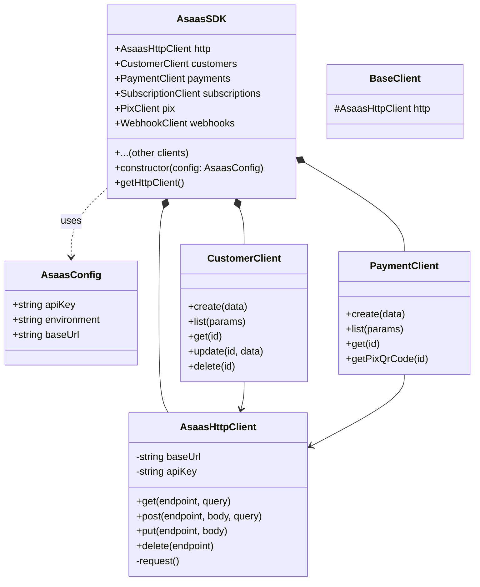

# Architecture Documentation

This document describes the high-level architecture of the `@eziocm/asaas-sdk`.

## Overview

The SDK is designed as a modular, client-based wrapper around the Asaas API v3. It uses a singleton-like pattern where the main `AsaasSDK` class acts as a factory and container for specific domain clients (e.g., `CustomerClient`, `PaymentClient`).

## Component Diagram



## Core Components

### 1. AsaasSDK (Main Entry Point)

The `AsaasSDK` class is the main entry point. It requires an `AsaasConfig` object to be initialized.

- **Responsibility**: Initialize the HTTP client and all domain-specific clients.
- **Usage**: Users instantiate this once and access all features through its properties (e.g., `asaas.customers`, `asaas.payments`).

### 2. AsaasHttpClient

A wrapper around the native `fetch` API.

- **Responsibility**:
  - Handles authentication (adds `access_token` header).
  - Manages the base URL based on the environment (Sandbox vs. Production).
  - Serializes request bodies to JSON.
  - Parses response JSON.
  - **Error Handling**: Intercepts non-200 responses and throws `AsaasApiError`.

### 3. Domain Clients

Each module (Customers, Payments, etc.) has its own client class (e.g., `CustomerClient`).

- **Responsibility**:
  - Provides typed methods for API endpoints (e.g., `create`, `list`).
  - Maps method arguments to API request bodies and query parameters.
  - Returns typed responses (e.g., `Promise<Customer>`).
- **Design**: stateless classes that hold a reference to `AsaasHttpClient`.

## Data Flow

1. **Initialization**: User creates `new AsaasSDK({ apiKey: '...' })`.
2. **Method Call**: User calls `asaas.payments.create(data)`.
3. **Client Delegation**: `PaymentClient.create` is invoked. It prepares the payload.
4. **HTTP Request**: `PaymentClient` calls `this.http.post('/payments', data)`.
5. **Network**: `AsaasHttpClient` adds headers and sends request to Asaas API.
6. **Response**:
   - **Success**: JSON is parsed and returned to the user.
   - **Error**: `AsaasApiError` is thrown containing status code and error details.

## Error Handling

Errors from the API are standardized into `AsaasApiError`.

```typescript
export class AsaasApiError extends Error {
    constructor(
        message: string,
        public statusCode: number,
        public asaasError: AsaasError
    ) { ... }
}
```

The `asaasError` property contains the raw error response from Asaas, allowing access to specific error codes (e.g., `invalid_cpf`).

## Type System

The SDK relies heavily on TypeScript interfaces defined in `src/types`.

- **Request Types**: `CustomerData`, `PaymentData`, etc.
- **Response Types**: `Customer`, `Payment`, `PaginatedResponse<T>`, etc.
- **Enums/Unions**: `BillingType`, `PaymentStatus`, etc.

This ensures type safety for both inputs and outputs.
